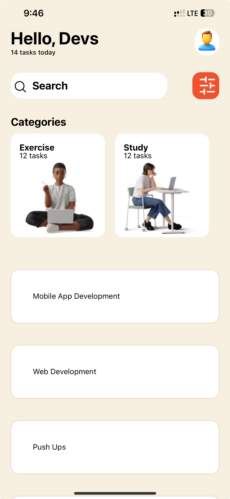

# Mobile Application Development - Assignment 3

## Description
This React Native application is designed to showcase various core components and custom components while adhering to a specific UI design. It includes eight categories such as Exercise, Study, Code, Cook, etc., and provides a list of 15 ongoing tasks.

## Core Components Used
- View: Used for structuring the layout of the application.
- Text: Displaying text content.
- ScrollView: Scrolling through content.
- TextInput: Input field for user interaction.
- Stylesheet: Styling components.
- Button: Interactive button for user actions.
- FlatList or SectionList: Rendering lists of tasks.
- Image: Displaying icons and images.

## Custom Components
Custom components are used throughout the application to enhance the user interface and provide a consistent design pattern. These components are created specifically for this application and are not part of the core React Native components.

## Screenshot
